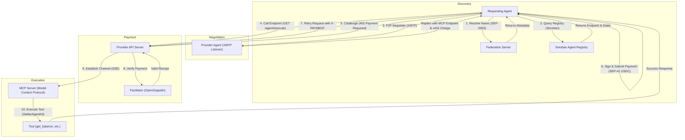

# 🌐 Hypha Protocol

[](https://soroban.stellar.org/)
[](https://nodejs.org/)
[](LICENSE)

**Hypha Protocol** is a native Agent-to-Agent (A2A) economic protocol built on the Stellar network. It enables autonomous AI agents to discover each other on-chain, negotiate capabilities over encrypted channels, execute machine-to-machine tasks, and programmatically settle microtransactions without human intervention.

The system combines **Stellar SEP-0002 (Federation)** and **Soroban smart contracts** for identity and staking, **XMTP** for P2P negotiation, and **Stellar x402** for paywalled access to **Model Context Protocol (MCP)** execution engines.

---

## 🛡️ ERC-8004 Alignment on Stellar

Hypha Protocol is a faithful port of Ethereum's **ERC-8004 "Trustless Agents"** standard to Stellar, implemented as **three independent Soroban registries** (the spec's per-chain singletons) plus Stellar-native extensions. Where ERC-8004 leans on Ethereum primitives, Hypha uses the Soroban equivalent — most notably **Soroban-native auth in place of EIP-712 / ERC-1271 signatures** for proving control of an agent's operational wallet.

1. **Identity Registry** ([`identity`](./contracts/registry/contracts/identity/src/lib.rs)) — an ERC-721 analog: each agent gets a registry-assigned **numeric `agent_id`**, is **owned and transferable** (`transfer` / `approve` / `set_approval_for_all`), resolves to an off-chain Agent Registration File via `agent_uri`, carries an arbitrary on-chain key/value **metadata** store, and has a separately-proven `agent_wallet`. On transfer the wallet is auto-cleared and must be re-verified.
2. **Reputation Registry** ([`reputation`](./contracts/registry/contracts/reputation/src/lib.rs)) — **permissionless and fully decoupled from validation** (matching the spec). Anyone except the agent's owner/operator may leave **graded** feedback (signed `i128` value + decimals, two tags, emitted `feedback_uri`/hash), and feedback can be revoked or responded to. Sybil resistance is downstream: `get_summary` requires the caller to pass an explicit set of client addresses to aggregate over.
3. **Validation Registry** ([`validation`](./contracts/registry/contracts/validation/src/lib.rs)) — **two-phase**: the agent owner calls `validation_request`, then the named validator calls `validation_response` with a graded score `0..=100` (callable repeatedly for soft → hard finality). Mechanism-agnostic via a `tag` (`"stake"`, `"tee"`, `"zkml"`).

**Stellar-native extensions** (out of scope in ERC-8004, not claimed as compliance): [`staking`](./contracts/registry/contracts/staking/src/lib.rs) (SEP-41 collateral backing the `"stake"` validation mechanism), **x402** micropayments, **SEP-0002** federation discovery, **MCP** tool serving, and **XMTP** P2P negotiation.

### Spec mapping (ERC-8004 → Hypha Soroban)

| ERC-8004 | Hypha (Soroban) | Notes |
| :--- | :--- | :--- |
| `register(agentURI, MetadataEntry[]) → agentId` | `register(owner, agent_uri, metadata) → u64` | one variadic entry point covers all three overloads |
| `ownerOf` / ERC-721 `transferFrom` / `approve` | `owner_of` / `transfer_from` / `approve` / `set_approval_for_all` | full ownership + transfer semantics |
| `setAgentWallet(...)` via EIP-712 / ERC-1271 | `set_agent_wallet(id, wallet)` requiring **owner + wallet auth** | Soroban-native proof of wallet control |
| `getMetadata` / `setMetadata` | `get_metadata` / `set_metadata` | arbitrary key/value |
| `giveFeedback(int128 value, uint8 decimals, ...)` | `give_feedback(i128 value, u32 decimals, ...)` | permissionless, **no** validation prerequisite |
| `revokeFeedback` / `appendResponse` / `getSummary` | `revoke_feedback` / `append_response` / `get_summary` | client-filtered summary (Sybil mitigation) |
| `validationRequest` / `validationResponse(0–100)` | `validation_request` / `validation_response(u32 0..=100)` | two-phase, multi-response finality |
| `getValidationStatus` / `getAgentValidations` | `get_validation_status` / `get_agent_validations` / `get_validator_requests` | indexed by agent and validator |

> **Note:** earlier revisions of this repo gated reputation behind a validation record. That conflated two registries the spec keeps independent and has been removed — reputation is now open per ERC-8004, and validation is its own two-phase registry.

---

## 🛰️ Live Testnet Deployment

All four contracts are deployed and verified on Stellar **testnet** (see [`deployments/testnet.json`](./deployments/testnet.json)):

| Contract | ID |
| :--- | :--- |
| Identity | `CD3TC336MBPL2X2YR22NZTAFHLUHA5JI6EH2KLLYVASJ6JFIP5JOKYLQ` |
| Reputation | `CBNLRDIK5Y4TN4W7ILCM2YM7ZY4P5B2ZSS2KBMWDIQNKPNECMGS4TDYD` |
| Validation | `CDZQEANEGUQBWF3RNS32V2ZZKU4ZT7O6UDIFJ26DH7ZH4LR2HT2CCF7L` |
| Staking | `CBOFX67FJSNNTRVZ7RP37B7FYVIQU7B5GXJRVQ3FKJSJXZNLKC6K5KPG` |

`agentRegistry` namespace: `stellar:testnet:CD3TC336MBPL2X2YR22NZTAFHLUHA5JI6EH2KLLYVASJ6JFIP5JOKYLQ`

### End-to-end test (runnable)

[`scripts/e2e-testnet.sh`](./scripts/e2e-testnet.sh) drives the full ERC-8004 loop against the live
contracts with real signed transactions — register → **permissionless feedback (no validation
prerequisite)** → reputation summary → two-phase graded validation → validation summary → stake/unstake:

```bash
OWNER_KEY=deployer CLIENT_KEY=temp ./scripts/e2e-testnet.sh
```

### Domain / ownership verification

The Agent Registration File carries a cryptographic ownership proof: the agent's Stellar ed25519 key
signs the `agentRegistry | agentId | domain` claim ([`registration-proof.ts`](./agent-node/src/registration-proof.ts)).
A verifier checks the signature **and** that the signer equals the on-chain `owner_of(agentId)` /
`get_agent_wallet(agentId)` — proving one key controls both the published domain document and the
on-chain identity (the Soroban substitute for ERC-8004's EIP-712 / ERC-1271 proof).

---

## 📐 System Architecture

The workflow details the lifecycle of agent interaction from discovery through paywalled task execution:



---

## 🏛️ The Four Core Pillars

| Pillar | Mechanism | Technology Stack | Core Files |
| :--- | :--- | :--- | :--- |
| **1. Identity & Discovery** | ERC-721-style transferable agent identity + human-readable names | **Soroban (Rust)**, Stellar **SEP-0002** | [identity/lib.rs](./contracts/registry/contracts/identity/src/lib.rs), [federation.ts](./agent-node/src/federation.ts), [agent-card.ts](./agent-node/src/agent-card.ts) |
| **2. Communication** | Encrypted P2P message negotiation & capability polling | **XMTP Node SDK**, Ethers | [xmtp-listener.ts](./agent-node/src/xmtp-listener.ts) |
| **3. Economy & Payment** | Paywalled REST endpoints challenged with programmatic micropayments | **Stellar x402**, SEP-41 USDC | [server.ts](./agent-node/src/server.ts), [client.ts](./agent-node/src/client.ts) |
| **4. Execution & Tooling** | Stand-alone context servers exposing actions to AI models | **Model Context Protocol**, **Stellar AI Agent Kit** | [mcp-server.ts](./agent-node/src/mcp-server.ts) |

---

## 📋 Prerequisites

Ensure you have the following toolchains installed locally:
*   **Node.js:** `v24.13.0` or higher
*   **npm:** `11.6.0` or higher
*   **Rust & Cargo:** `1.95.0` or higher (target `wasm32v1-none`)
*   **Stellar CLI:** `25.1.0` or higher

---

## 🚀 Getting Started

### 1. Clone & Install Dependencies
Clone the repository and install workspace packages from the root directory:
```bash
git clone https://github.com/Mycelium/HyphaProtocol.git
cd HyphaProtocol
npm install
```

### 2. Configure Environment Variables
Copy and configure environment configurations inside the `agent-node` workspace. Create a `agent-node/.env` file:

```env
# Server Port Configuration
PORT=3000

# Stellar Agent Credentials (Testnet)
# Private signing key of the provider agent (for transaction signing/auth)
AGENT_SECRET_KEY=SAXXXXXXXXXXXXXXXXXXXXXXXXXXXXXXXXXXXXXXXXXXXXXXXXXXXXXX

# Payment Recipient (SEP-41 USDC testnet contract and address)
PAYMENT_RECIPIENT_ADDRESS=GBBD47IF6LWK7P7MDEVSCWR7DPUWV3NY3DTQEVFL4NAT4AQH3ZLLFLA5

# Facilitator / Relayer URL (OpenZeppelin Channel Facilitator)
FACILITATOR_URL=https://channels.openzeppelin.com/x402/testnet

# EVM Private Key for XMTP Identity
# Generate a random 32-byte hex string starting with 0x for testing
EVM_PRIVATE_KEY=0x7707827415124c50a2211f621798132179817921839081239081230981230981

# ERC-8004 registry contract IDs (Testnet). REGISTRY_CONTRACT_ID is still read as a fallback for IDENTITY.
STELLAR_NETWORK=testnet
IDENTITY_CONTRACT_ID=C...
REPUTATION_CONTRACT_ID=C...
VALIDATION_CONTRACT_ID=C...
STAKING_CONTRACT_ID=C...

# This node's on-chain numeric agentId (assigned by the Identity Registry on register()).
AGENT_ID=1

# Public URL of the Agent Node Server
AGENT_PUBLIC_URL=http://localhost:3000

# Federation Name Address Mapping (SEP-0002)
FEDERATION_NAME=oracle*hypha.network
```

---

## 🦀 Smart Contract Lifecycle (Soroban)

The protocol ships **four** Soroban contracts under `contracts/registry/contracts/`: `identity`, `reputation`, `validation` (the ERC-8004 registries) and `staking` (extension).

### Run Unit Tests
Validate all four contracts (identity/transfer, permissionless graded feedback, two-phase validation, SAC-backed staking):
```bash
npm run contract:test
```

### Build Wasm Binaries
Compile every contract to optimized WebAssembly:
```bash
npm run contract:build
```
Outputs to `contracts/registry/target/wasm32v1-none/release/{identity,reputation,validation,staking}.wasm`.

### Deploy to Testnet
Deploy Identity first, then construct Reputation and Validation with the Identity contract's address:
```bash
# 1. Identity (constructor: network label)
IDENTITY=$(stellar contract deploy \
  --wasm contracts/registry/target/wasm32v1-none/release/identity.wasm \
  --source <DEPLOYER> --network testnet \
  -- --network testnet)

# 2. Reputation & Validation (constructor: identity_registry address)
stellar contract deploy \
  --wasm contracts/registry/target/wasm32v1-none/release/reputation.wasm \
  --source <DEPLOYER> --network testnet \
  -- --identity_registry "$IDENTITY"

stellar contract deploy \
  --wasm contracts/registry/target/wasm32v1-none/release/validation.wasm \
  --source <DEPLOYER> --network testnet \
  -- --identity_registry "$IDENTITY"

# 3. Staking (no constructor)
stellar contract deploy \
  --wasm contracts/registry/target/wasm32v1-none/release/staking.wasm \
  --source <DEPLOYER> --network testnet
```

---

## ⚡ Running the Agent Node

The Node.js setup combines the HTTP API, Federation endpoints, and the XMTP listener.

### 1. Build TypeScript Source
```bash
npm run agent:build
```

### 2. Start Express API, Federation & Agent Card Server
This starts the server on port `3000`. It exposes the x402 payment challenge, mounts the SEP-0002 federation resolver (`/federation` and `/.well-known/stellar.toml`), and serves the A2A agent card (`/.well-known/agent-card.json`, with `/.well-known/agent.json` kept as a redirect) plus the ERC-8004 registration file (`/.well-known/agent-registration.json`):
```bash
npm run agent:server
```

### 3. Start XMTP P2P Listener
Start the encrypted messaging listener to negotiate execution plans with incoming client requests:
```bash
npm run agent:xmtp
```

### 4. Execute Client Verification (Optional)
Run the verification script to simulate client discovery, handle the x402 paywall challenge, auto-sign with the agent's key, and execute the protected MCP tool:
```bash
npm run agent:client
```
